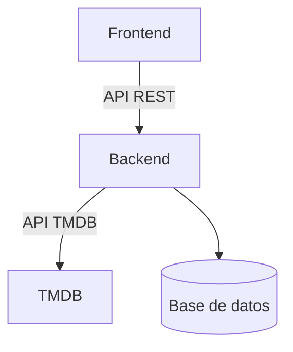

# Arquitectura (Legacy)

## Diagrama

## Responsabilidades
- **Frontend:** Interfaz de usuario, consumo de API propia.
- **Backend:** Orquestación, normalización de datos, persistencia.
- **DB:** Almacenamiento normalizado.
- **TMDB:** Fuente externa de datos.
